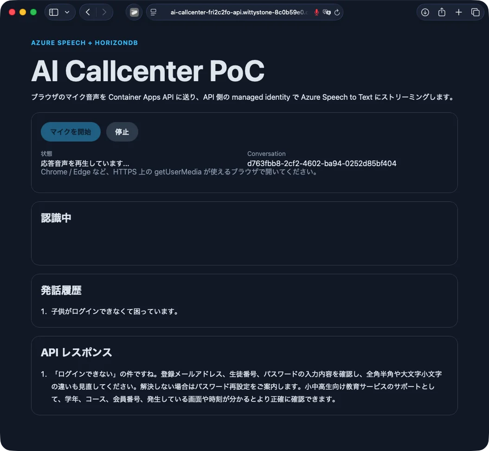

# HorizonDB AI Call Center

An Azure sample for a browser-based AI call center. The app streams microphone audio from a SPA to an ASP.NET Core API, transcribes it with Azure AI Speech, searches expected responses in Azure HorizonDB with vector embeddings, reranks candidates with Azure OpenAI, and plays the selected response with Speech TTS.



## What is included

- ASP.NET Core API hosted on Azure Container Apps
- Browser SPA for microphone input and response playback
- Azure HorizonDB schema and seed response data
- Azure OpenAI embeddings and chat-based reranking
- Azure AI Speech STT/TTS using managed identity
- `azd up` infrastructure with Bicep

## Prerequisites

- Azure subscription with access to:
  - Azure HorizonDB preview
  - Azure OpenAI model deployments for `text-embedding-3-large` and `gpt-4o-mini`
  - Azure AI Speech
- Azure Developer CLI `azd` 1.25 or later
- Azure CLI
- Docker
- .NET SDK 10
- `psql`
- Python 3

Sign in before deployment:

```sh
az login
azd auth login
```

## Deploy

```sh
git clone https://github.com/rioriost/horizondb_ai_callcenter.git
cd horizondb_ai_callcenter

azd env new <your-env-name>
azd env config set infra.parameters.location centralus
azd up
```

The deployment creates Azure resources, applies the HorizonDB schema, registers model aliases, seeds response data, generates embeddings, builds the container image, and deploys the API.

Supported HorizonDB preview regions are defined in `infra/main.bicep`.

## Run after deployment

Open the deployed service URL:

```sh
azd env get-value SERVICE_API_URI
```

In the browser:

1. Open the URL.
2. Allow microphone access.
3. Select **マイクを開始**.
4. Speak into the microphone.
5. The app shows the transcript, selects a response, and plays it back.

For a text-only smoke test:

```sh
base=$(azd env get-value SERVICE_API_URI)
conversation=$(curl -fsS -X POST "$base/api/conversations" \
  -H 'content-type: application/json' \
  -d '{}' | python3 -c 'import sys,json; print(json.load(sys.stdin)["conversationId"])')

curl -fsS -X POST "$base/api/conversations/$conversation/respond" \
  -H 'content-type: application/json' \
  -d '{"text":"教材がまだ届いていません","sequenceNo":0}'
```

## Updating seed responses

Edit `infra/scripts/seed.sql`, then run:

```sh
azd hooks run postprovision
```

The hook inserts or updates enabled responses and generates embeddings for rows that do not have one.

## Re-provisioning note

HorizonDB is a preview service and some cluster properties are immutable. If you re-run provisioning against an environment that already has the HorizonDB cluster and receive an immutable property error, create `infra/main.parameters.json` locally with:

```json
{
  "$schema": "https://schema.management.azure.com/schemas/2019-04-01/deploymentParameters.json#",
  "contentVersion": "1.0.0.0",
  "parameters": {
    "name": { "value": "ai-callcenter" },
    "environmentName": { "value": "ai-callcenter" },
    "location": { "value": "${AZURE_LOCATION}" },
    "useExistingHorizonDb": { "value": true }
  }
}
```

Do not commit environment-specific parameter files.

## License

MIT

---

# HorizonDB AI Call Center（日本語）

ブラウザで動く AI コールセンターの Azure サンプルです。SPA からマイク音声を ASP.NET Core API にストリーミングし、Azure AI Speech で文字起こし、Azure HorizonDB のベクトル検索で想定応答を探し、Azure OpenAI で候補を再ランクし、選ばれた応答を Speech TTS で再生します。

## 含まれるもの

- Azure Container Apps 上の ASP.NET Core API
- マイク入力と応答再生用のブラウザ SPA
- Azure HorizonDB の schema と初期応答データ
- Azure OpenAI による embedding と rerank
- Managed Identity を使った Azure AI Speech STT/TTS
- `azd up` 用の Bicep インフラ

## 事前準備

- 次を利用できる Azure サブスクリプション
  - Azure HorizonDB preview
  - `text-embedding-3-large` と `gpt-4o-mini` の Azure OpenAI deployment
  - Azure AI Speech
- Azure Developer CLI `azd` 1.25 以降
- Azure CLI
- Docker
- .NET SDK 10
- `psql`
- Python 3

先にログインします。

```sh
az login
azd auth login
```

## デプロイ

```sh
git clone https://github.com/rioriost/horizondb_ai_callcenter.git
cd horizondb_ai_callcenter

azd env new <your-env-name>
azd env config set infra.parameters.location centralus
azd up
```

Azure リソース作成、HorizonDB schema 適用、モデル alias 登録、初期応答データ投入、embedding 生成、コンテナーの build/deploy まで実行します。

HorizonDB preview の対応リージョンは `infra/main.bicep` に定義しています。

## デプロイ後の実行

デプロイされた URL を確認します。

```sh
azd env get-value SERVICE_API_URI
```

ブラウザでの操作:

1. URL を開く。
2. マイク使用を許可する。
3. **マイクを開始** を押す。
4. マイクに向かって話す。
5. 文字起こし、応答選択、音声再生が実行される。

テキストだけで確認する場合:

```sh
base=$(azd env get-value SERVICE_API_URI)
conversation=$(curl -fsS -X POST "$base/api/conversations" \
  -H 'content-type: application/json' \
  -d '{}' | python3 -c 'import sys,json; print(json.load(sys.stdin)["conversationId"])')

curl -fsS -X POST "$base/api/conversations/$conversation/respond" \
  -H 'content-type: application/json' \
  -d '{"text":"教材がまだ届いていません","sequenceNo":0}'
```

## 初期応答データの更新

`infra/scripts/seed.sql` を編集してから実行します。

```sh
azd hooks run postprovision
```

hook は応答データを追加・更新し、embedding が未生成の行だけをベクトル化します。

## 再プロビジョニング時の注意

HorizonDB は preview で、一部の cluster property は更新できません。既存 HorizonDB cluster がある環境へ再プロビジョニングして immutable property error が出る場合は、ローカルに `infra/main.parameters.json` を作成してください。

```json
{
  "$schema": "https://schema.management.azure.com/schemas/2019-04-01/deploymentParameters.json#",
  "contentVersion": "1.0.0.0",
  "parameters": {
    "name": { "value": "ai-callcenter" },
    "environmentName": { "value": "ai-callcenter" },
    "location": { "value": "${AZURE_LOCATION}" },
    "useExistingHorizonDb": { "value": true }
  }
}
```

環境固有の parameter file は commit しないでください。

## ライセンス

MIT
